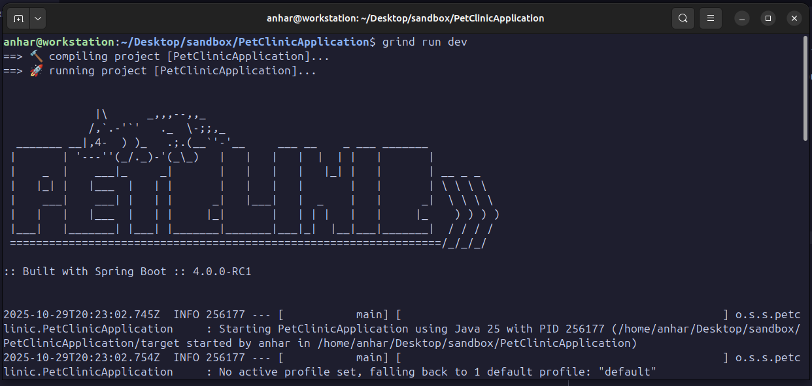

# PetClinicApplication

The purpose of this repo is test out if [Grind](https://github.com/AnharHussainMiah/grind) the new java build tool, can fully build and run the famous [Pet Clinic Spring Demo](https://github.com/spring-projects/spring-petclinic).

The `Pet Clinic` demo is very useful because we have a non trivial codebase that we can compare against `maven` in turns of dependency resolution and build behaviour.

## How to compile

first make sure all the dependencies are installed:

```shell
$ grind install
```

And then you can build and run your project with the follwoing command:

```shell
$ grind build
```

### Screenshot

`grind` compiling and running the `Pet Clinic` demo


